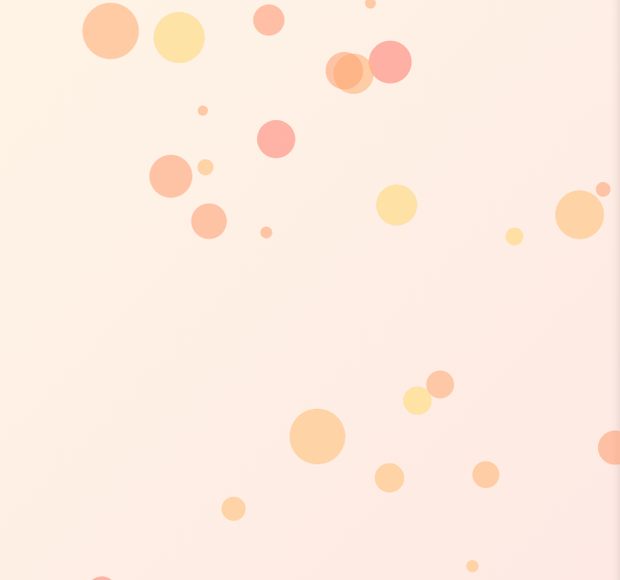

<!-- README.md is generated from README.Rmd. Please edit that file -->

# bubblyr <a></a>

<!-- badges: start -->

[](https://cran.r-project.org/package=bubblyr)

[](https://cran.r-project.org/package=bubblyr)


[](https://choosealicense.com/licenses/mit/)

[](https://travis-ci.com/feddelegrand7/bubblyr)

<!-- badges: end -->

`bubblyr` is an R wrapper of the JavaScript library
[bubbly-bg](https://github.com/tipsy/bubbly-bg). It allows you to add
beautiful animated bubbles within Shiny and RMarkdown backgrounds. You
can choose from several themes and apply the animation with one line of
code.

<center>


## Installation

You can install the `bubblyr` package from CRAN with:

``` r

install.packages("bubblyr")
```

You can install the development version of `bubblyr` from Github with:

``` r

install.packages("remotes") #if not installed

remotes::install_github("feddelegrand7/bubblyr")
```

# Themes

Here a list of all the available themes. Note that The ocean, cherry,
hippie, bigmom and deepsea themes are provided by the author of the
bubbly-bg JavaScript library, I just gave them some fancy names:

| Themes   |
| :------- |
| ocean    |
| cherry   |
| hippie   |
| bigmom   |
| deepsea  |
| illusion |
| rstudio  |
| ash      |
| classy   |
| volcano  |
| lacoste  |
| warmup   |
| fire     |
| traffic  |
| life     |
| darksky  |
| orangina |
| meteor   |
| gravitas |
| rladies  |
| sunshine |
| sweet    |
| lalaland |

Below you can find some examples, feel free to experiment the remaining
themes:

##### Important: You may experiment some lags when viewing your Shiny/Rmd Document in the RStudio pane, use the browser instead.

``` r
library(shiny)
library(bubblyr)

ui <- fluidPage(

    bubbly(theme = "bigmom")

)

server <- function(input, output) {}

shinyApp(ui = ui, server = server)
```



``` r
library(shiny)
library(bubblyr)

ui <- fluidPage(

    bubbly(theme = "rstudio")

)

server <- function(input, output) {}

shinyApp(ui = ui, server = server)
```


``` r
library(shiny)
library(bubblyr)

ui <- fluidPage(

    bubbly(theme = "classy")

)

server <- function(input, output) {}

shinyApp(ui = ui, server = server)
```


## Code of Conduct

Please note that the bubblyr project is released with a [Contributor
Code of
Conduct](https://contributor-covenant.org/version/2/0/CODE_OF_CONDUCT.html).
By contributing to this project, you agree to abide by its terms.
